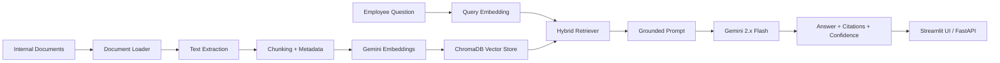

# RAGbot

A practical Retrieval Augmented Generation (RAG) application that answers questions from uploaded documents and cites the source document and page.

## Features

- PDF, Markdown, and text ingestion
- Text extraction with PyMuPDF
- Overlapping document chunking with metadata
- Gemini `gemini-embedding-001` embeddings
- Local ChromaDB vector index
- Hybrid retrieval using semantic similarity plus keyword overlap
- Gemini `gemini-2.0-flash` grounded answer generation
- Source citations with document name, page, chunk, and retrieval score
- Streamlit chat UI with conversation memory
- Saved chat sessions with separate document snapshots and indexes
- Optional FastAPI `/ask` endpoint
- Unit tests and a simple evaluation script for assignment reporting

## Architecture



## Project Structure

```text
enterprise-knowledge-assistant/
├── app.py                  # Streamlit chat UI
├── api.py                  # Optional FastAPI API
├── evaluate.py             # Basic evaluation runner
├── rag/
│   ├── ingestion.py        # Load, chunk, embed, store documents
│   ├── retriever.py        # Semantic + keyword hybrid retrieval
│   ├── generator.py        # Gemini answer generation
│   └── config.py           # Environment and path configuration
├── data/
│   ├── documents/          # Default API document folder
│   └── chat_sessions/      # Auto-created UI chat/session state
├── chroma_db/              # Auto-created local vector store
├── requirements.txt
├── tests/
├── .env.example
└── SYSTEM_DESIGN.md
```

## Setup

1. Create and activate a virtual environment:

```bash
python -m venv .venv
.venv\Scripts\activate
```

2. Install dependencies:

```bash
pip install -r requirements.txt
```

3. Create a `.env` file:

```bash
copy .env.example .env
```

4. Add your Gemini API key:

```env
GEMINI_API_KEY=your_gemini_api_key_here
```

Get a Gemini API key from Google AI Studio.

## Running the Streamlit App

```bash
python -m streamlit run app.py
```

In the sidebar:

1. Click `New chat` when starting a different document set.
2. Upload PDFs, Markdown, or text files.
3. Keep `Replace this chat's knowledge base on ingest` enabled if only the current uploads should be used.
4. Click `Ingest / Rebuild Index`.
5. Ask questions in the chat box.
6. Review citations under `Sources`.

Each chat has its own saved messages, uploaded document snapshot, and ChromaDB collection. Reopening an old chat restores the index that belonged to that chat, so follow-up questions do not accidentally use newer documents.

## Running the API

Start the API:

```bash
uvicorn api:app --reload
```

Ingest documents already placed in `data/documents`:

```bash
curl -X POST http://127.0.0.1:8000/ingest
```

Ask a question:

```bash
curl -X POST http://127.0.0.1:8000/ask ^
  -H "Content-Type: application/json" ^
  -d "{\"question\":\"What is the employee leave policy?\",\"top_k\":5}"
```

Example response:

```json
{
  "answer": "Employees are eligible for 24 paid leaves annually.",
  "sources": [
    {
      "document": "HR_Policy.pdf",
      "page": 12,
      "chunk": 2,
      "score": 0.91
    }
  ],
  "confidence": 0.91,
  "answer_found": true
}
```

## Technology Choices

- **Language:** Python
- **UI:** Streamlit
- **API:** FastAPI
- **LLM:** Gemini Flash models through `google-genai`
- **Embeddings:** Gemini `gemini-embedding-001` with fallback embedding model names
- **Vector database:** Local persistent ChromaDB
- **PDF parsing:** PyMuPDF

## Design Decisions

### Chunking

The ingestion pipeline uses approximately 500-word chunks with a 50-word overlap. This keeps each chunk large enough to preserve policy or process context while reducing the risk that relevant facts are split across chunks. Page number metadata is attached before chunking so every answer can cite the original location.

### Embeddings

The project uses Google's `gemini-embedding-001` through the newer `google-genai` SDK because it is compatible with the current Gemini API and free-tier friendly. Document chunks use the `RETRIEVAL_DOCUMENT` task type and user questions use `RETRIEVAL_QUERY`.

### Vector Store

ChromaDB is used as a local persistent vector store. It requires no external service and is appropriate for an assignment or small internal prototype. The index is stored in `chroma_db`.

The Streamlit UI creates one Chroma collection per chat session. This lets users switch back to an old chat and continue asking questions against the same documents used earlier.

### Retrieval

Retrieval is hybrid:

- Semantic similarity finds conceptually relevant chunks.
- Keyword overlap boosts chunks that contain exact business terms from the question.

The retriever fetches more semantic candidates than it finally returns, re-scores them with the hybrid score, and sends the best chunks to the generator.

### Prompt Design

The generation prompt explicitly instructs the model to answer only from retrieved context and to say when information is unavailable. It also handles broad questions such as "summarize this document" by summarizing the retrieved context instead of refusing. The model is asked for JSON output so the application can reliably extract whether an answer was found.

### Hallucination Prevention

- The model only receives retrieved document chunks as context.
- The prompt instructs Gemini not to invent policies, numbers, dates, names, or sources.
- If retrieval returns no chunks or confidence is low, the system says the information was not found.
- Citations are attached from stored metadata, not generated freely by the model.
- Temperature is kept low to reduce randomness.

### Confidence

Confidence is a pragmatic score based on the top hybrid retrieval score plus a small bonus when multiple supporting sources agree. It should be treated as a retrieval confidence estimate, not as a mathematical guarantee.

## Evaluation Approach

Run unit tests:

```bash
python -m unittest discover -s tests
```

These tests cover chunk overlap, keyword matching, JSON response parsing, and confidence scoring.

Run:

```bash
python evaluate.py
```

This writes `evaluation_results.json` with answers, citations, confidence scores, and a simple keyword pass/fail check.

For a stronger evaluation, create a JSON test file:

```json
[
  {
    "question": "How many paid leaves do employees get annually?",
    "expected_keywords": ["24", "paid", "leave"]
  },
  {
    "question": "What is the refund policy?",
    "expected_keywords": ["refund"]
  }
]
```

Then run:

```bash
python evaluate.py --tests tests.json
```

Recommended manual checks:

- Ask direct factual questions with known answers.
- Ask ambiguous questions and confirm the assistant requests or implies the need for more specificity.
- Ask questions not present in the documents and confirm it does not hallucinate.
- Verify source page citations against the original PDFs.

Current verification performed during development:

- Python syntax checks with `python -m py_compile`.
- Unit tests with `python -m unittest discover -s tests`.
- Linter check on edited files in Cursor.
- Manual Streamlit checks for ingestion, indexed chunk count, source citations, conversation memory, and chat-specific knowledge bases.

## Known Limitations

- Scanned PDFs need OCR before ingestion.
- ChromaDB local storage is not ideal for multi-user production deployments.
- Confidence is heuristic and should not be used for compliance decisions.
- The current hybrid search is lightweight; BM25 or a production search engine would improve keyword retrieval.
- The app does not include authentication or document-level permissions.
- The FastAPI API uses the default knowledge base path and does not expose the Streamlit per-chat session selector.

## Future Improvements

- Add OCR support for scanned documents.
- Add BM25-based hybrid retrieval.
- Add cross-encoder re-ranking.
- Add query rewriting for vague follow-up questions.
- Add document access control by user role.
- Add user feedback and analytics.
- Deploy with a managed vector database and observability.

