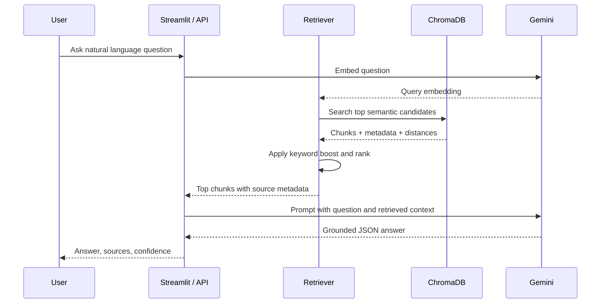

# System Design Document

## High-Level Architecture

RAGbot is a Retrieval Augmented Generation system for answering questions from uploaded internal documents. It separates knowledge storage from answer generation: documents are ingested into a searchable vector index, and each user question retrieves relevant evidence before the LLM writes an answer.

The system has five main components:

1. Document ingestion
2. Embedding and indexing
3. Hybrid retrieval
4. Grounded answer generation
5. User interface and API

## Data Flow

## Component Explanation

### Document Ingestion

Documents are loaded from either the default API folder (`data/documents`) or a Streamlit chat-session document folder (`data/chat_sessions/<session_id>/documents`). PDFs are parsed with PyMuPDF and text files are read directly. Each PDF page is extracted separately so the page number can be preserved as citation metadata.

Text is chunked into approximately 500-word chunks with 50 words of overlap. This balances retrieval precision and contextual completeness. Smaller chunks can improve precision but may lose surrounding policy detail; larger chunks can preserve context but may dilute similarity search.

### Embedding and Indexing

Each chunk is embedded with Gemini `gemini-embedding-001` using the `RETRIEVAL_DOCUMENT` task type. Chunks, embeddings, and metadata are stored in a persistent local ChromaDB collection using cosine distance.

The Streamlit app creates a separate ChromaDB collection per chat session. This prevents a newly uploaded document set from polluting older chats and allows the user to reopen an old chat with its original knowledge base.

Metadata includes:

- Document filename
- Source path
- Page number
- Chunk number

This metadata supports transparent citations in the UI and API response.

### Retrieval Strategy

At query time, the question is embedded using `RETRIEVAL_QUERY`. ChromaDB returns the top semantic candidates. The retriever then applies a lightweight keyword overlap score and combines it with semantic similarity:

- 80% semantic score
- 20% keyword score

This hybrid strategy helps when users ask about exact policy names, acronyms, or domain-specific terms that dense embeddings may underweight.

### Answer Generation

Gemini Flash models, defaulting to `gemini-2.0-flash`, receive the question, recent chat history, and retrieved context. The generator has model fallback support for current Gemini 2.x Flash model names. The prompt instructs the model to answer only from the context and to explicitly say when information is unavailable. The response is requested as JSON with:

- `answer`
- `answer_found`

The application attaches citations from retrieved metadata instead of asking the model to invent citations.

### User Interface

The Streamlit UI allows users to upload documents, rebuild the index, ask questions, inspect sources, and switch between saved chats. Conversation memory is implemented per chat and can be toggled from the sidebar. Each chat stores its own messages, uploaded document snapshot, and ChromaDB collection.

The optional FastAPI app exposes:

- `GET /health`
- `POST /ingest`
- `POST /ask`

The API is intentionally simple and uses the default knowledge base path. The richer per-chat session behavior is implemented in the Streamlit interface.

## Scalability Considerations

For a production deployment, ChromaDB local persistence should be replaced or backed by a managed vector database such as Pinecone, Weaviate, or a server-hosted Chroma deployment. Document ingestion should run as a background job with retry handling, status tracking, and incremental indexing.

For larger document sets, retrieval quality can be improved with:

- BM25 plus vector hybrid search
- Cross-encoder re-ranking
- Query rewriting
- Metadata filters by department, document type, or access level
- Deduplication and versioning for updated policies

Security should include authentication, authorization, audit logging, and document-level access controls so users only retrieve content they are permitted to view.

## Evaluation Plan

Evaluation should combine automated checks and manual review:

- Create a test set of representative employee questions.
- Include answerable, ambiguous, and unanswerable questions.
- Track whether expected keywords appear in the answer.
- Verify whether cited documents and pages support the answer.
- Monitor hallucination rate by testing questions outside the indexed knowledge base.

The included `evaluate.py` script provides a simple starting point. In production, evaluation should use a larger golden dataset and judge retrieval recall, citation accuracy, answer faithfulness, and user satisfaction.

The repository also includes unit tests for deterministic core behavior:

- Chunk overlap
- Keyword matching
- JSON parsing
- Confidence scoring

## Limitations

- Scanned PDFs require OCR before ingestion.
- Tables and complex layouts may not extract perfectly from PDFs.
- The confidence score is heuristic.
- Conversation memory is session-local.
- No authentication or permissions are implemented in this prototype.
- The API does not expose Streamlit chat-session selection.

